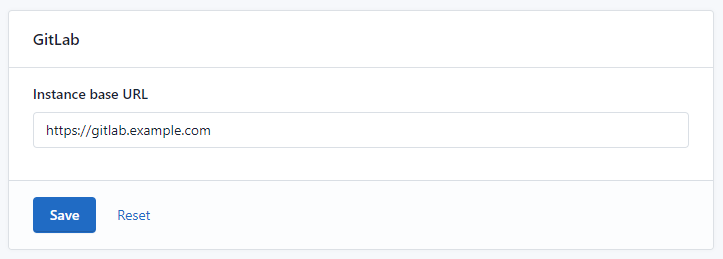
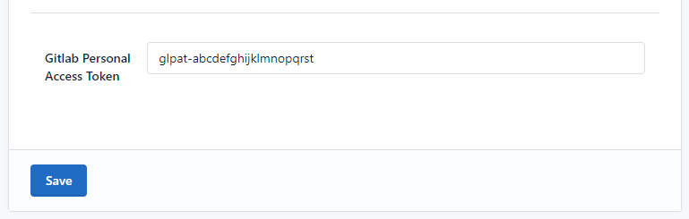
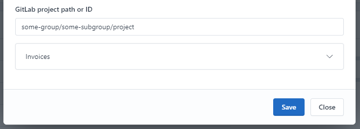
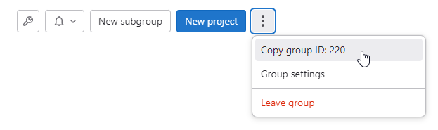
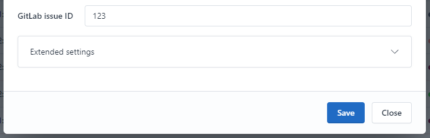
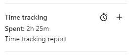

# GitlabConnectorBundle plugin

A Kimai 2 plugin to send your tracked times to GitLab as time spent in issues.

## Table of Contents

- [Prerequisites](#prerequisites)
- [Installation](#installation)
- [Configuration](#configuration)
  - [Configure the GitLab base URL](#configure-the-gitlab-base-url)
  - [Configure the personal access token](#configure-the-personal-access-token)
- [Sending tracked times to GitLab](#sending-tracked-times-to-gitlab)
  - [Option 1: Configure a project path and issue ID](#option-1-configure-a-project-path-and-issue-id)
  - [Option 2: Put a full GitLab issue URL in the timesheet description](#option-2-put-a-full-gitlab-issue-url-in-the-timesheet-description)
  - [Option 3: Configure a project path, but put the issue ID in the timesheet description](#option-3-configure-a-project-path-but-put-the-issue-id-in-the-timesheet-description)
- [Results](#results)
- [How does it work?](#how-does-it-work)
- [Contribution](#contribution)

## Prerequisites

- Kimai 2.18+
- PHP 8.1+

## Installation

First, clone it to the `plugins` directory of your Kimai installation:
```sh
cd /kimai/var/plugins/
git clone https://github.com/Physikbuddha/GitlabConnectorBundle.git
```

Then rebuild the cache: 
```sh
cd /kimai/
bin/console kimai:reload -n
```

Alternatively, you can [download the latest version](https://github.com/Physikbuddha/GitlabConnectorBundle/archive/refs/heads/main.zip) and unzip it on your server into the `var/plugins` directory:

```plaintext
/kimai/var/plugins/
├── GitlabConnectorBundle/
│   ├── GitlabConnectorBundle.php
|   └ ... more files and directories follow here ... 
```

## Configuration

### Configure the GitLab base URL

In your Kimai instance, go to System > Settings > GitLab and enter the base URL of your GitLab instance in the format `https://gitlab.example.com`:



### Configure the personal access token

The plugin needs to authenticate with the GitLab API by using a personal access token. Each Kimai user has to generate and configure their own access token, as this will save the GitLab time logs under their own name.

Generate a personal access token that has at least access to the `api` scope. You can find this in your GitLab user settings > Access Tokens. See the [GitLab documentation on access tokens](https://docs.gitlab.com/ee/user/profile/personal_access_tokens.html) for more information.

Enter your personal access token in Kimai by clicking your profile picture > Preferences > GitLab Personal Access Token:



## Sending tracked times to GitLab

You have multiple options to let Kimai know which GitLab project and issue to send your tracked times to.

### Option 1: Configure a project path and issue ID

The most straightforward way to send your tracked times to GitLab is to set the GitLab project path in your Kimai project and the GitLab issue ID in the Kimai timesheet settings when you track your times.

#### Set the GitLab project path

To set the GitLab project path, open the settings of your Kimai project and locate the field `GitLab project path or ID`:



> **Heads up!** This field will only be visible if you have configured the GitLab base URL for your Kimai instance.

This field will accept either the full project path or the GitLab project ID. The project path is usually more verbose, but remember that it is not guaranteed to stay constant, as it will change when you rename or move the project in GitLab. On the other hand, the project ID is a unique identifier that will not change.

To get the project path, open your project in GitLab and copy the path from the URL. If your project URL is `https://gitlab.example.com/some-group/some-subgroup/project`, the project path is `some-group/some-subgroup/project`.

To get the project ID, open your project in GitLab and click the `Copy group ID` button in the project header:



#### Set the GitLab issue ID

When you create or edit a Kimai timesheet, a field to put the GitLab issue ID will be shown:



> **Heads up!** This field will only be visible if you have configured the GitLab personal access token in your user settings. The field might also be hidden if the selected project does not have a GitLab project path or ID set.

### Option 2: Put a full GitLab issue URL in the timesheet description

If you don't want to set the GitLab project path in your Kimai project settings or want to override that setting for a certain timesheet entry, you can put the full GitLab issue URL in the description of the timesheet entry. The plugin will extract the project path and issue ID from the URL.

> **Heads up!** The plugin will only attempt to extract the issue information from the description if you leave the GitLab issue ID field empty. Filling the GitLab issue ID will always take precedence over the description.

The URL will only be recognized if you either:
- Paste it at the very beginning of the description, like
```plaintext
https://gitlab.example.com/group/project/-/issues/123
Implemented feature XYZ and fixed some bugs
```
- Surround it with square brackets. In this case, the URL might appear anywhere in the description, like
```plaintext
Implemented feature XYZ 
[https://gitlab.example.com/group/project/-/issues/123]
Also fixed some bugs
```

### Option 3: Configure a project path, but put the issue ID in the timesheet description

In case you are more comfortable with skipping the issue ID field and rather want to paste the issue ID into the description, you can do so. The plugin will still recognize the project path from the Kimai project settings and will attempt to extract the issue ID from the description.

> **Heads up!** Similar to option 2, the plugin will only attempt to extract the issue ID from the description if you leave the dedicated GitLab issue ID field empty. Filling the GitLab issue ID will always take precedence over the description.

To put the issue ID in the description, always prefix it with `#`, like `#123`. Also similar to option 2, the issue ID will only be recognized if you either:
- Paste it at the very beginning of the description, like
```plaintext
#123 Implemented feature XYZ and fixed some bugs
```
- Surround it with square brackets. In this case, the issue ID might appear anywhere in the description, like
```plaintext
Implemented feature XYZ [#123] like discussed in the meeting (see #456)
Also fixed some bugs.
```
> **Note!** In this example, the tracked time will **not** be sent to issue 456, because it was not surrounded by square brackets. 

## Results

After you save a timesheet on Kimai, the spent time will be shown in the GitLab issue.



## How does it work?

The plugin uses the GitLab GraphQL API to retrieve, create, and delete time logs. Whenever an update of a time log is necessary, the plugin will delete the old time log and create a new one. This is necessary because the GitLab API does not allow updating time logs.

## Contribution

Contributions are welcome! Please open an issue or submit a pull request on GitHub.